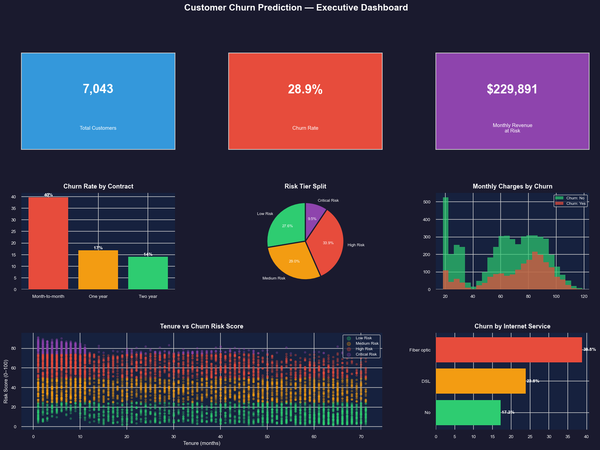

# 📉 Customer Churn Prediction
### IBM Telco Dataset | End-to-End ML Pipeline + Deployed Web App


---

## 🚀 Live Application

👉 https://customerchurnprediction7900.streamlit.app

This application predicts customer churn risk in real-time and provides actionable insights for retention strategies.
---

## 📌 Problem Statement

Telecom companies lose 15–25% of customers annually to churn.
Acquiring a new customer costs **5–7× more** than retaining an existing one.

This project builds a **production-style churn prediction system** — from raw data to a deployed web application that:
- Predicts which customers will churn **before they leave**
- Explains **why** using feature importance
- Assigns a **0–100 risk score** with automated business action recommendations
- Puts **₹229,000+ in monthly revenue** back in control

---

## 📁 Project Structure

```
CustomerChurnPrediction/
│
├── data/
│   ├── generate_dataset.py           ← Synthetic data generator
│   ├── telco_churn.csv               ← Raw dataset (7,043 records)
│   ├── telco_churn_cleaned.csv       ← Cleaned + feature engineered
│   ├── telco_churn_balanced.csv      ← Class-balanced (oversampled)
│   └── telco_churn_risk_scored.csv   ← Risk scores added (Power BI ready)
│
├── notebooks/
│   ├── 01_data_exploration.ipynb     ← EDA, distributions, churn patterns
│   ├── 02_data_cleaning.ipynb        ← Cleaning, encoding, feature engineering
│   ├── 03_model_building.ipynb       ← LR, RF, GB — training & evaluation
│   ├── 04_risk_scoring_insights.ipynb← 0–100 risk scores, tier segmentation
│   └── 05_summary_dashboard.ipynb   ← Final dashboard + summary CSV
│
├── charts/                           ← 14 saved visualizations
│   ├── 01_churn_distribution.png
│   ├── 02_numerical_distributions.png
│   ├── 03_churn_by_contract.png
│   ├── 04_churn_by_service_payment.png
│   ├── 05_tenure_vs_charges_scatter.png
│   ├── 06_correlation_heatmap.png
│   ├── 07_model_comparison.png
│   ├── 08_confusion_matrices.png
│   ├── 09_roc_curves.png
│   ├── 10_feature_importance.png
│   ├── 11_risk_tier_distribution.png
│   ├── 12_risk_score_distribution.png
│   ├── 13_metrics_by_risk_tier.png
│   ├── 14_final_summary_dashboard.png
│   └── statistical_summary.csv
│
├── sql/
│   ├── schema.sql                    ← MySQL schema (4 tables)
│   └── queries.sql                   ← 12 business intelligence queries
│
├── api/
│   ├── model.pkl                     ← Trained Random Forest model
│   └── features.pkl                  ← Feature list for consistent encoding
│
├── app_ui.py                         ← Streamlit web application
├── run_pipeline.py                   ← One-command full pipeline execution
├── requirements.txt
└── README.md
```

---

## 🛠️ Tech Stack

| Layer | Technology | Purpose |
|---|---|---|
| Language | Python 3.8+ | Core pipeline |
| Data Processing | Pandas, NumPy | Cleaning, feature engineering |
| Machine Learning | Scikit-learn | LR, Random Forest, Gradient Boosting |
| Imbalance Handling | Oversampling (resample) | Fix 72/28 class imbalance |
| Visualization | Matplotlib, Seaborn | 14 charts |
| Database | MySQL | Customer + risk score storage |
| Dashboard | Power BI | Executive churn dashboard |
| Web App | Streamlit | Interactive prediction UI |
| Deployment | Streamlit Community Cloud | Free public hosting |

---

## 📊 Dataset

- **Source:** IBM Telco Customer Churn
- **Records:** 7,043 customers
- **Features:** 21 raw + 4 engineered
- **Target:** `Churn` — Yes / No
- **Churn Rate:** ~28.85% (class imbalance handled)

### Engineered Features

| Feature | Description |
|---|---|
| `TenureGroup` | Bucketed tenure: 0–1yr, 1–2yr, 2–4yr, 4+yr |
| `NumServices` | Count of active add-on services (0–6) |
| `ChargePerTenure` | MonthlyCharges / (tenure + 1) |
| `HighValue` | 1 if MonthlyCharges > 75th percentile |

---

## 🤖 Model Performance

| Model | Precision | Recall | F1 Score | ROC-AUC |
|---|---|---|---|---|
| Logistic Regression | 0.703 | 0.705 | 0.704 | 0.760 |
| **Random Forest** ✅ | **0.810** | **0.794** | **0.802** | **0.872** |
| Gradient Boosting | 0.752 | 0.739 | 0.745 | 0.803 |

> **Random Forest selected as final model** — best F1 (0.802) and ROC-AUC (0.872).
> Recall is prioritised over Precision — missing a churner costs real revenue.

---

## 🎯 Risk Score System

| Score | Tier | Recommended Action |
|---|---|---|
| 0 – 25 | 🟢 Low Risk | Standard engagement — quarterly check-in |
| 25 – 50 | 🟡 Medium Risk | Loyalty rewards — prompt contract upgrade |
| 50 – 75 | 🔴 High Risk | Proactive outreach — personalised offer |
| 75 – 100 | 🚨 Critical | Immediate escalation — priority discount |

---

## 💡 Key Business Findings

- **Month-to-month contracts** churn at ~42% vs ~11% for two-year contracts
- **Fiber optic** customers churn at nearly **2× the rate** of DSL customers
- **Electronic check** users have the highest churn rate (~34%)
- Customers in their **first 12 months** are **3× more likely** to churn
- **3,056 customers** currently at High or Critical risk
- **₹229,000+/month** in revenue at risk from High + Critical tier customers

---

## 📊 Dashboard Preview



---

## ▶️ How to Run Locally

```bash
# 1. Clone the repo
git clone https://github.com/adityabobade7900/CustomerChurnPrediction.git
cd CustomerChurnPrediction

# 2. Install dependencies
pip install -r requirements.txt

# 3. Generate dataset
python data/generate_dataset.py

# 4. Run full pipeline (all charts + data files)
python run_pipeline.py

# 5. Launch the web app
streamlit run app_ui.py

# 6. (Optional) Set up MySQL
mysql -u root -p < sql/schema.sql
```

---

## ☁️ Deploy on Streamlit Cloud (Free)

1. Push this repo to GitHub
2. Go to [share.streamlit.io](https://share.streamlit.io)
3. Connect your GitHub repo
4. Set main file: `app_ui.py`
5. Click Deploy → get a live public URL in under 2 minutes

---

## 👨‍💻 Author

**Aditya Bobade** — Data Science Trainee | Python | ML | MySQL | Power BI

[](https://github.com/adityabobade7900/CustomerChurnPrediction)
[](https://www.linkedin.com/in/adityabobade7900)
[](mailto:bobade1436@gmail.com)
---

## 📞 Need Help?

If you have any questions, suggestions, or run into any issues, feel free to reach out:

| Platform    | Link                                                                          |
|-------------|-------------------------------------------------------------------------------|
| 💼 LinkedIn  | [linkedin.com/in/adityabobade](https://linkedin.com/in/adityabobade)          |
| 📧 Email     | [bobade1436@gmail.com](mailto:bobade1436@gmail.com)                           |

---

## 📄 License

MIT License — free to use, modify, and share for learning purposes.
